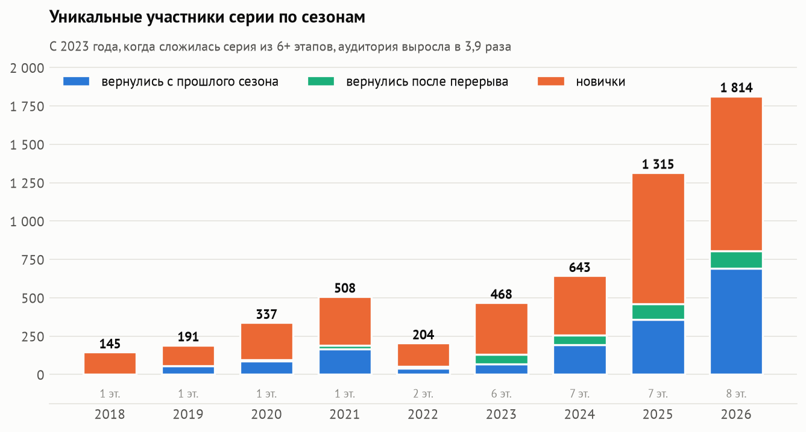
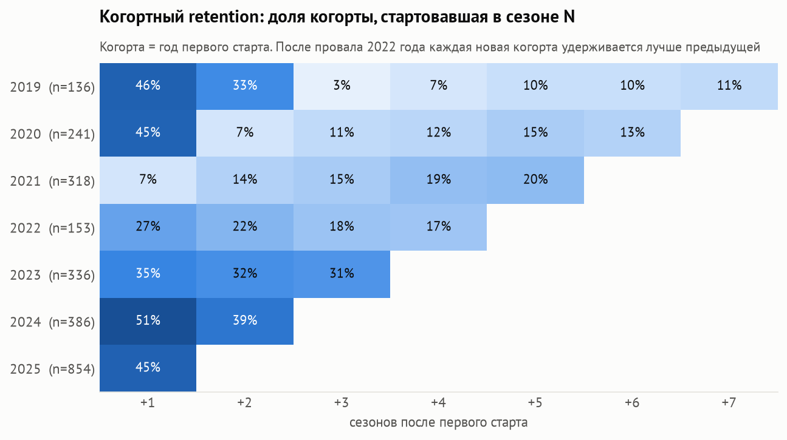
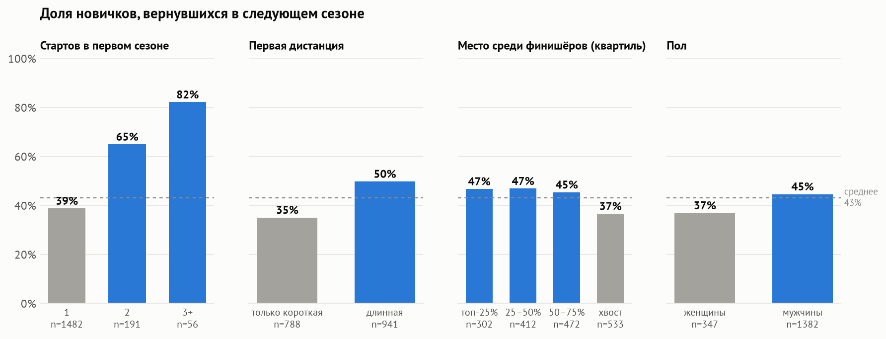
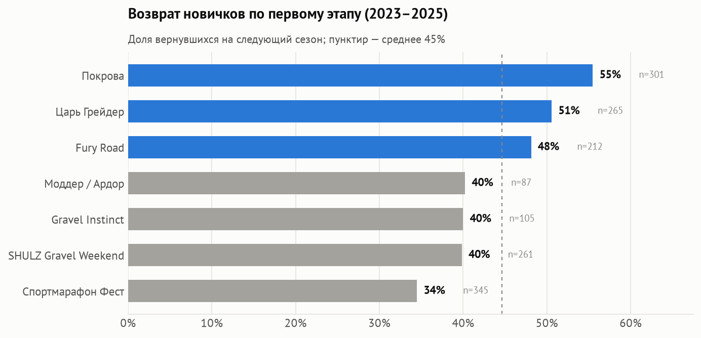
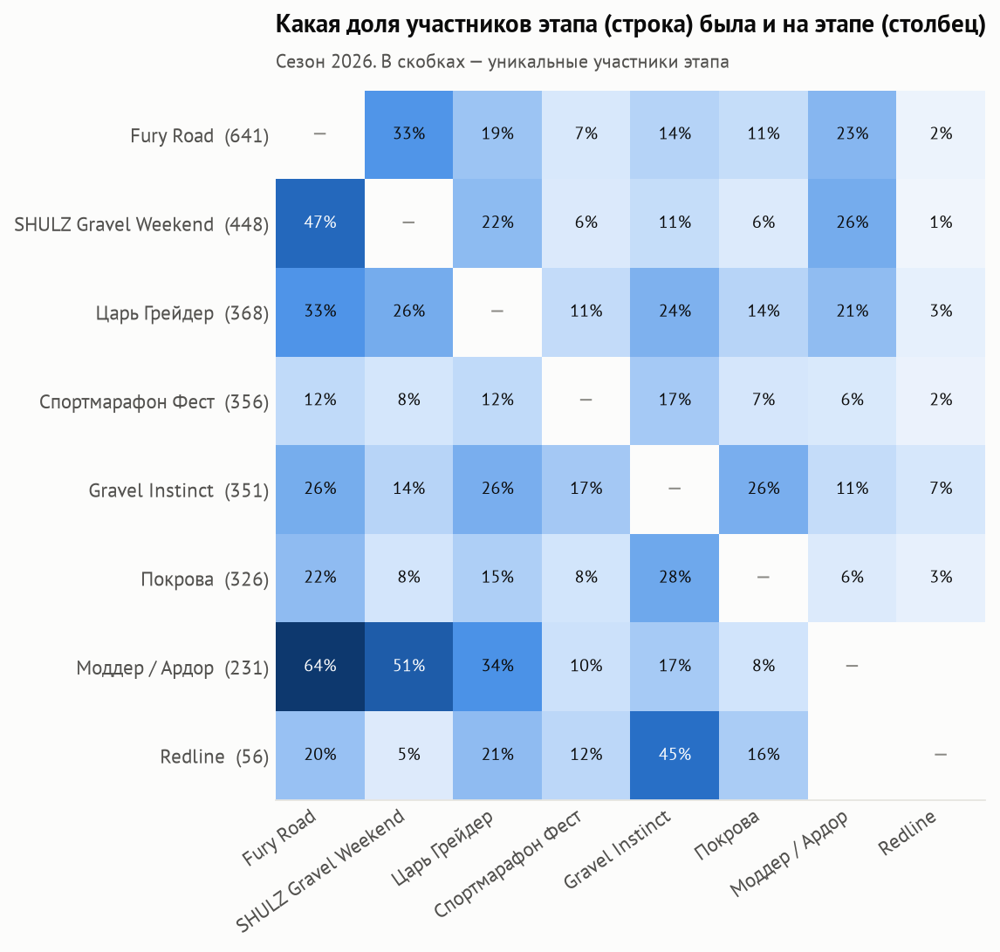
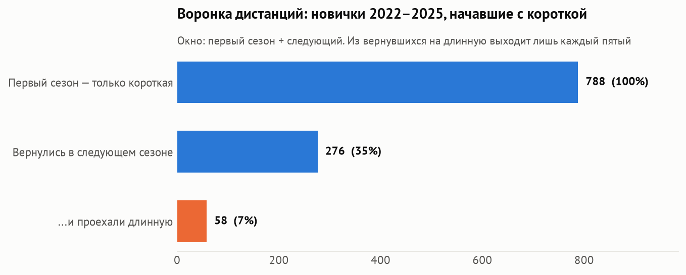

# Русская гравийная серия как продукт

Продуктовая аналитика [Русской гравийной серии](https://gravelseries.ru): **34 этапа, 7 682 результата, 3 684 гонщика, 2018–2026**.

Серия гревел-гонок рассматривается как продукт: гонщик — пользователь, старт — сессия, сезон — период.
Отсюда знакомый набор метрик: рост аудитории, новые и вернувшиеся, когортный retention, aha-момент, пересечение аудиторий,
воронка. В конце — рекомендации и дизайн A/B-теста для проверки главного вывода.

**Заказчик** — объединение организаторов серии. **Решение:** куда вкладывать усилия между сезонами — в привлечение новичков,
в их удержание или в связку этапов между собой.

**Автор:** Царегородский Александр

**Стек:** Python (pandas, statsmodels) · DuckDB + SQL · matplotlib · Jupyter · HTML/JS-дашборд

📓 [Ноутбук с анализом](notebooks/analysis.ipynb) · 📊 [Интерактивный дашборд](dashboard/index.html) · 🖥 [Презентация (PDF)](presentation/Presentation_RGS.pdf)

---

## Ключевые выводы

### 1. Аудитория выросла в 12 раз, и растёт она за счёт удержания


145 участников в 2018 году → **1 814 в 2026-м**. Частота выросла с 1,01 до 1,54 старта на гонщика.
В 2026 году впервые больше трети аудитории — вернувшиеся с прошлого сезона.

### 2. Обвал 2022 года и восстановление retention


Когда серией была одна гонка, на следующий сезон возвращались ~45%. [«Обратная сторона дороги»](https://shchepinov.pro/reverse-race-5/)
прошла в последний раз в 2021 году; в 2022-м было всего два этапа (Спорт-Марафон Фест и SHULZ), и у когорты 2021 года вернулись лишь **7%**:
людей держало конкретное событие. С появлением общего календаря retention +1 восстановился до **51%**, хотя когорты выросли в 2–3 раза.

### 3. Aha-момент — второй старт в первом сезоне


| Фактор первого сезона | OR (год) | OR (год + первый этап) |
|---|---|---|
| 2+ старта | **2,66** [1,96–3,60] | **2,92** [2,11–4,03] |
| длинная дистанция | 1,55 [1,26–1,92] | 1,34 [1,00–1,78], p = 0,047 |
| финиш в последней четверти | 0,69 [0,56–0,86] | 0,68 [0,54–0,85] |
| женщина | 0,82, незначимо | 0,80, незначимо |

*Логистическая регрессия, новички 2022–2025 (n = 1 729). Вторая модель проверяет альтернативное объяснение «дело в этапе, а не в числе стартов».*

→ Главный рычаг удержания — довести новичка до второго старта в том же сезоне.
Самоотбор по мотивации на этих данных исключить нельзя, поэтому вывод нужно проверить экспериментом.

### Дизайн A/B-теста

Промокод на следующий этап для финишёров первого старта. Основная метрика — доля новичков с 2+ стартами в сезоне
(база 19,1% в 2025 году); вторичная — возврат в следующем сезоне; защитная — выручка с новичка.
При ~850 новичках за сезон и сплите 50/50 **MDE ≈ 9 п.п.** (α = 0,05, мощность 80%). Для эффекта в +5 п.п. нужно ~2 120 новичков, то есть два сезона.

### 4. Этапы различаются как «точки входа», у серии есть ядро



### 5. Короткая дистанция — отдельный продукт, а не ступенька


С короткой на следующий сезон возвращаются 35% (с длинной — 50%), и из вернувшихся на длинную переходит лишь 21%.
Первая версия этой воронки считала переход за всё время и давала 53%. Это было завышение из-за разного окна наблюдения у когорт,
поэтому окно выровнено: первый сезон + следующий.

## Рекомендации организаторам

| # | Инсайт | Что делать |
|---|---|---|
| 1 | Второй старт в первом сезоне: шансы вернуться ×2,7–2,9 | A/B-тест промокода на второй этап; затем «паспорт серии», зачёт новичков |
| 2 | Короткая удерживает 35% против 50% у длинной; на длинную за сезон переходит 21% вернувшихся | Растить удержание короткой как отдельного продукта |
| 3 | Fury Road — крупнейший вход, но лишь 23% его участников едут Ардор | Кросс-промо из крупнейшего этапа в остальные |
| 4 | Спортмарафон удерживает 34% новичков, Покрова — 55% | Разобрать и перенести практики лидеров |
| 5 | Неявка (DNS) на короткие дистанции фестиваля — 23–27% | Напоминания перед стартом, лист ожидания |

## Как устроен проект

```
gravelseries.ru API ──► extract.py ──► data/raw/*.json
                                         │
                        transform.py ◄───┘  очистка, парсинг времени, сведение гонщиков
                             │
                             ▼
              data/processed/*.parquet  (звёздная схема: fct_result, dim_rider, dim_race, dim_event)
                             │
                   load.py ──► DuckDB + sql/marts.sql (витрины: сезоны, когорты, пересечения, воронка, сходы)
                             │
          ┌──────────────────┴──────────────────┐
  notebooks/analysis.ipynb            dashboard_data.py ──► dashboard/index.html
  (анализ, статистика, графики)       (интерактивный дашборд, только агрегаты)
          │
  presentation/slides.html ──► Presentation_RGS.pdf (10 слайдов)
```

### Самое трудное — очистка данных

| Проблема | Решение |
|---|---|
| Один человек записан по-разному: «ЦАРЕВ СЕРГЕЙ» / «Сергей Царев» / «Дима» / с отчеством | Ключ из нормализованных токенов: регистр, ё→е, отчество отбрасывается, уменьшительные имена → полные, алиас для фамилии в скобках |
| Фамилии на «-вич» путаются с отчествами (Борилкевич) | Отчество ищется только на 2–3 позиции и только по полным суффиксам |
| 6 форматов времени | Единый парсер → секунды |
| Пустые статусы в старых протоколах | С очками → финиш без времени, без очков → сход |
| Километраж есть не везде | Парсинг из названия + уровень дистанции из `maxPoints` |

**Валидация сведения** по ID гонщиков из API рейтингов сайта (2 450 человек): не склеен **1** (смена фамилии).
Нашлось ~20 дублей, которые пропустил сам сайт («Саша/Александр»). Тёзки — ~0,3%.

## Запуск

```bash
uv sync          # окружение
make all         # extract → transform → load → notebook → dashboard
```

## Ограничения

- Гонщики сводятся по имени: тёзки считаются одним человеком (~0,3%).
- Сходы и неявки есть не во всех протоколах.
- Нет возраста, региона и цены слота, поэтому рекомендации — гипотезы для A/B-проверки, а не доказанная причинность.
- У этапов до 2026 года в архиве нет дат, поэтому порядок стартов внутри сезона не определён.

---
Данные: открытый архив протоколов [gravelseries.ru](https://gravelseries.ru/results). Некоммерческий учебный проект.
