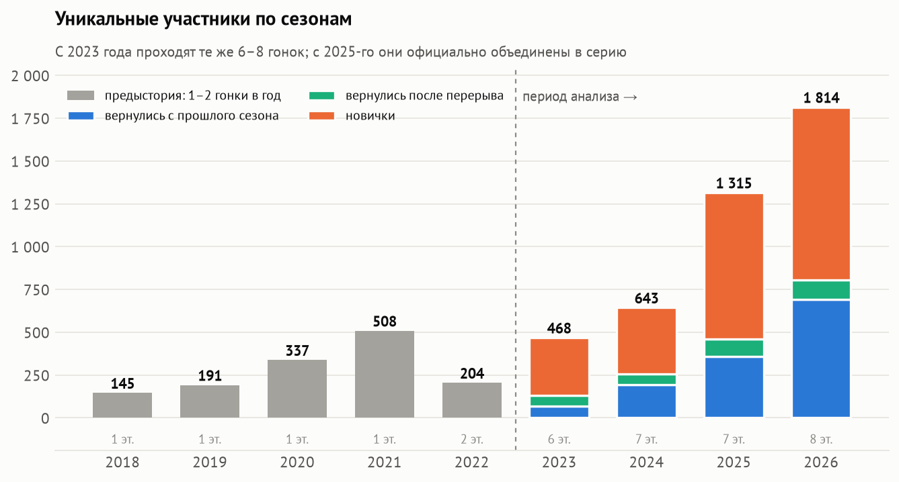
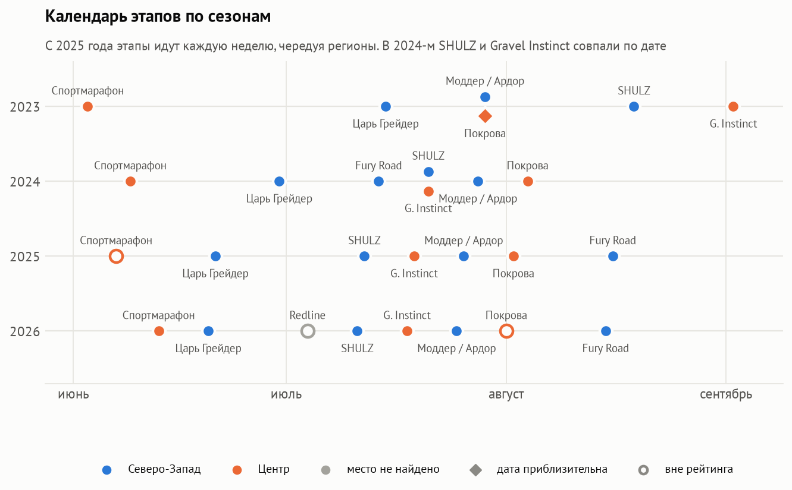
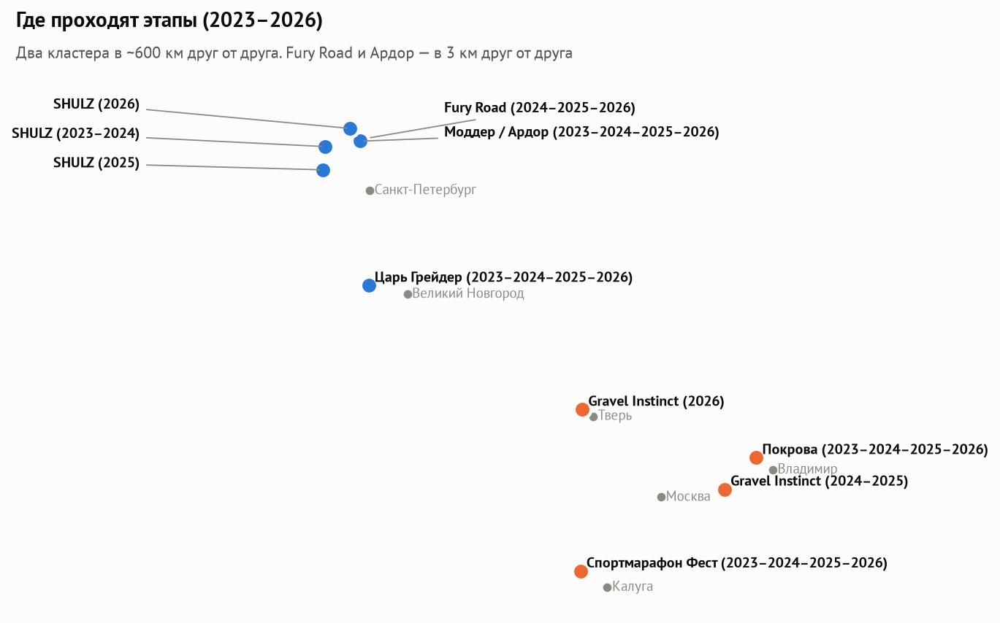
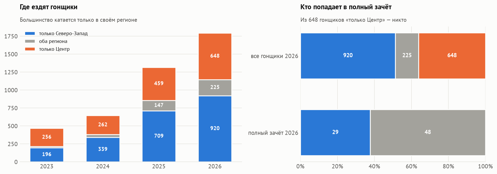
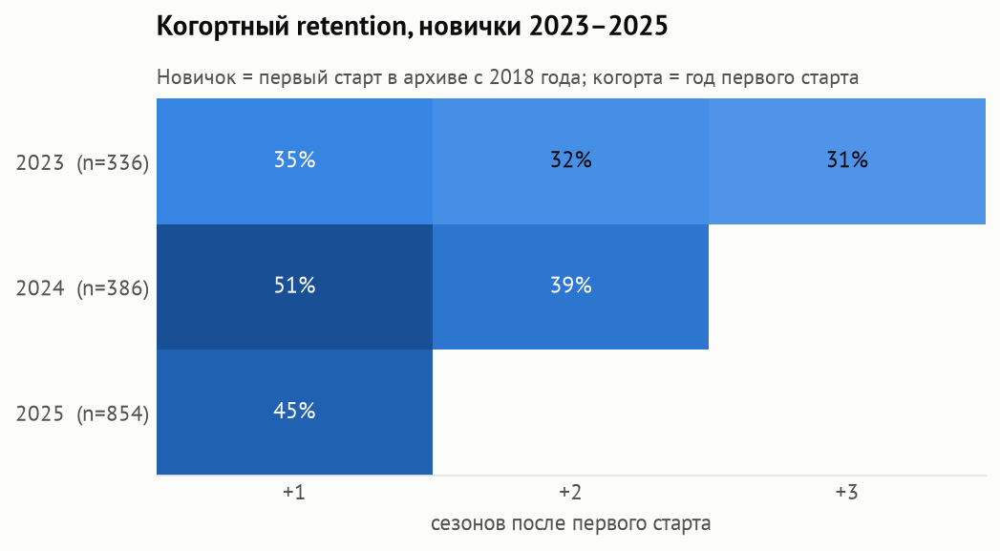
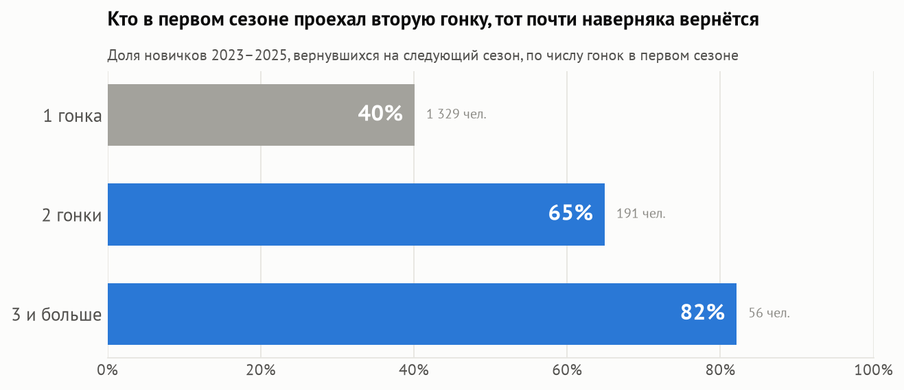
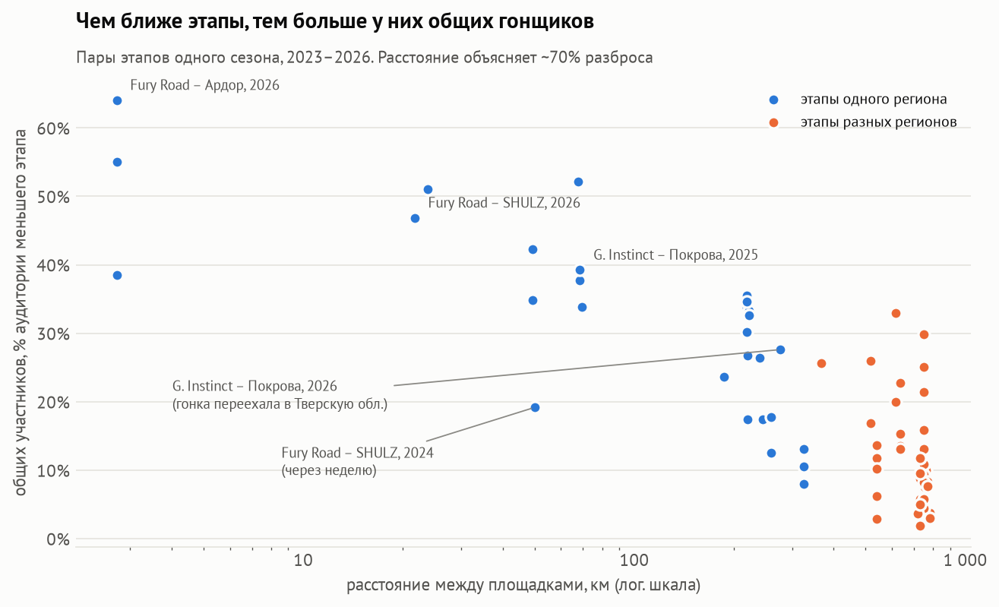
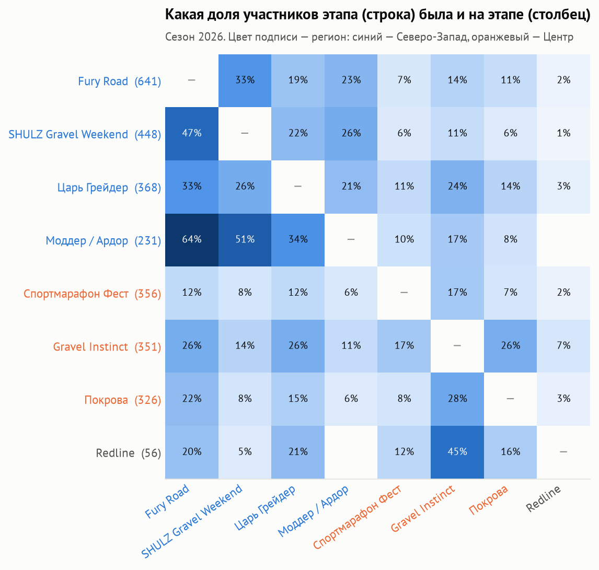
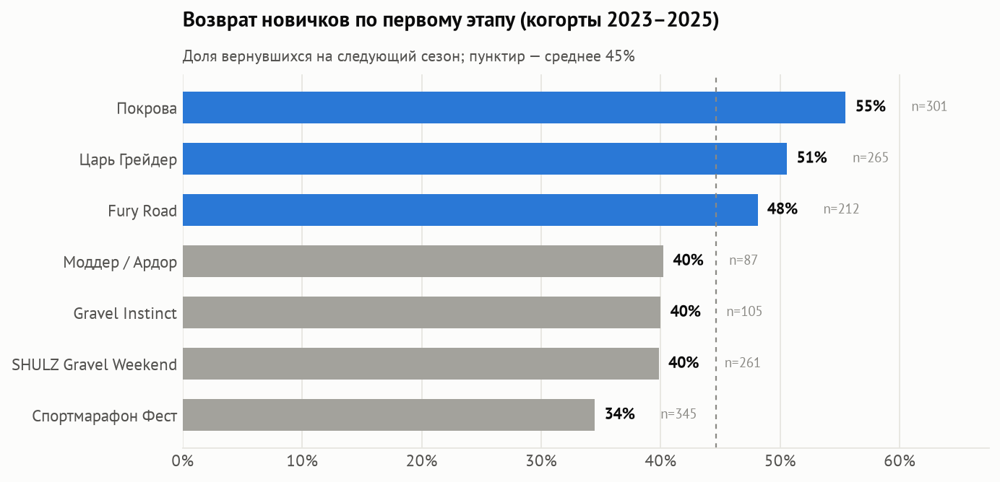
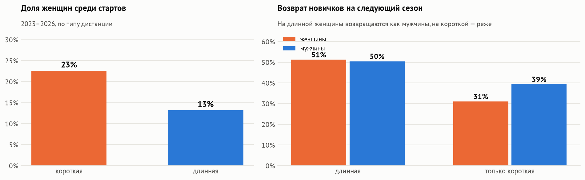

# Русская гравийная серия как продукт

Продуктовая аналитика [Русской гравийной серии](https://gravelseries.ru) за сезоны **2023–2026**:
28 этапов, 6 279 результатов, 2 972 гонщика. Плюс справочник площадок и дат, собранный по сайтам и каналам гонок.

Серия рассматривается как продукт: гонщик — пользователь, старт — сессия, сезон — период. Отсюда метрики: рост аудитории,
новые и вернувшиеся, когортный retention, aha-момент, пересечение аудиторий этапов, воронка. Отдельный блок — **как календарь
и география этапов определяют, кто куда ездит**. В конце — рекомендации и дизайн A/B-теста для проверки главного вывода.

**Заказчик** — объединение организаторов серии. **Решение:** куда вкладывать усилия между сезонами — в привлечение новичков,
в их удержание, в календарь или в связку этапов между собой.

**Автор:** Царегородский Александр

**Стек:** Python (pandas, statsmodels) · DuckDB + SQL · matplotlib · Jupyter · HTML/JS-дашборд

📓 [Ноутбук с анализом](notebooks/analysis.ipynb) · 📊 [Интерактивный дашборд](dashboard/index.html) · 🖥 [Презентация (PDF)](presentation/Presentation_RGS.pdf)

---

## Почему 2023–2026



До 2023 года это были одна-две гонки в год: Gravel King (2018) и «Обратная сторона дороги» под Петербургом (2019–2021).
С 2023-го каждый сезон проходит один и тот же набор из 6–8 гонок, а в 2025 году они
[официально объединены в серию](https://velo.gravelo.ru/russkaya-gravijnaya-seriya-2026/). Сравнивать одну гонку с серией некорректно,
поэтому все метрики считаются с 2023 года. Ранние годы нужны только чтобы не считать новичком ветерана, вернувшегося в 2023-м.

## Ключевые выводы

### 1. Серия — это два региональных кластера




**Северо-Запад**: Царь Грейдер (Новгородская обл.), SHULZ, Моддер/Ардор, Fury Road (Карельский перешеек).
**Центр**: Спортмарафон Фест («Никола-Ленивец»), Gravel Instinct (у Покрова, в 2026 году — Тверская обл.), Покрова (Владимирская обл.).

- **Моддер и Ардор — одна гонка**: у станции Петяярви в последние выходные июля. В 2023–2024 годах она шла в рамках MODDER CX CAMP, с 2025-го называется ARDOR GRAVEL RACE.
- **Fury Road и Ардор** проходят в 3 км друг от друга.
- В 2025–2026 годах этапы идут **каждую неделю** с середины июня до середины августа, и регионы чередуются.
- Не все этапы входят в рейтинг серии: **Покрова** была в рейтинге в 2024–2025 годах и выведена из него в 2026-м, **Спортмарафон** не входил в 2025-м.
  **Redline** (4 июля 2026, 56 финишёров) есть в архиве протоколов сайта, но не входит ни в рейтинг, ни в календарь серии; в выводах о регионах и календаре он не учитывается.

### 2. Кто катается только в Центре, в полный зачёт не попадает



Полный зачёт серии — 4 рейтинговые гонки. В 2026 году рейтинговых этапов 4 на Северо-Западе и 2 в Центре (Покрова вне рейтинга).
Большинство гонщиков катается только в своём регионе: 920 — только на Северо-Западе, 648 — только в Центре, 225 — в обоих.
В полном зачёте **77 человек: 48 ездили в оба региона, 29 — только на Северо-Западе, из 648 гонщиков «только Центр» — никого**.
Гонщику с Северо-Запада для зачёта ехать никуда не нужно, гонщику из Центра — минимум дважды под Петербург.

**Предложение — региональные зачёты** «Север» (Царь Грейдер, SHULZ, Ардор, Fury Road) и «Центр» (Спортмарафон, Gravel Instinct и Покрова — вернув её в рейтинг)
с порогом **2 этапа своего региона**. Порог совпадает с aha-моментом (вывод 5). По данным 2026 года в борьбе оказались бы 143 гонщика в «Центре» и 356 в «Севере» —
против 77 в нынешнем полном зачёте. Общий зачёт по 4 гонкам остаётся «абсолютом».

> Первая версия этого вывода («в полном зачёте 65 гонщиков Северо-Запада и 5 из Центра») опиралась на «домашний регион» по большинству стартов.
> Такая разметка смещена: гонщик из Центра, набравший зачёт, обязательно ездил под Петербург и записывался в Северо-Запад. Исправлено на группы «только СЗ / только Центр / оба».

### 3. Рост: аудитория ×3,9, частота стартов ×1,3

468 участников в 2023 году → **1 814** в 2026-м; 1,15 → **1,54** старта на гонщика. В 2026 году 38% аудитории вернулись с прошлого сезона.
Доля проехавших 2+ этапа выросла с 12% до 31%, ездящих в оба региона — с 3% до 12%.

### 4. Удержание: 35% → 51% → 45%



### 5. Aha-момент — второй старт в первом сезоне



| Фактор первого сезона | OR (год) | OR (год + первый этап) |
|---|---|---|
| 2+ старта | **2,69** [1,98–3,64] | **2,92** [2,12–4,03] |
| длинная дистанция | 1,50 [1,20–1,87] | 1,27 [0,94–1,72], незначимо |
| финиш в последней четверти | 0,68 [0,54–0,85] | 0,67 [0,53–0,84] |
| женщина | 0,84, незначимо | 0,83, незначимо |

*Логистическая регрессия, новички 2023–2025 (n = 1 576). Вторая модель проверяет альтернативное объяснение «дело в этапе, а не в числе стартов».*

Регион первого сезона на возврат не влияет (45% против 44%). Самоотбор по мотивации на этих данных исключить нельзя, поэтому вывод нужно проверить экспериментом.

**Дизайн A/B-теста.** Промокод на следующий этап своего региона для финишёров первого старта. Основная метрика — доля новичков
с 2+ стартами в сезоне (база 19,1% в 2025 году); вторичная — возврат в следующем сезоне; защитная — выручка с новичка; стратификация по региону и этапу.
При ~850 новичках за сезон и сплите 50/50 **MDE ≈ 9 п.п.** (α = 0,05, мощность 80%). Для +5 п.п. нужно ~2 120 новичков, то есть два сезона.

### 6. Общую аудиторию этапов определяет расстояние



По 69 парам этапов одного сезона расстояние между площадками объясняет **~70% разброса** доли общих участников.
Внутри региона общих участников обычно около трети, между регионами — около 10%. Два эпизода показывают ту же связь:
- **Fury Road** в 2024 году стоял за неделю до SHULZ — общих участников было 19%. После переноса на август — 34% (2025) и 47% (2026).
  Перенос совпал с запуском серии, поэтому эффект календаря не доказан.
- **Gravel Instinct** в 2026 году переехал из-под Покрова в Тверскую область, и общая аудитория с Покровой упала с 39% до 28%.

**Что это значит для календаря.** Ставить подряд сначала один регион, потом другой — плохая идея: этапы одного региона окажутся через неделю,
как в 2024 году (19–42% общих участников против 47–64% в 2026-м при интервалах 2–3 недели). Нынешнее чередование регионов правильное.



### 7. Точки входа и дистанции




С короткой дистанции на следующий сезон возвращаются 37% (с длинной — 51%), и из вернувшихся на длинную переходит лишь 21%.
Короткая дистанция — отдельный продукт, а не ступенька к длинной. Первая версия этой воронки давала 53%: у ранних когорт
было больше лет на переход. Окно наблюдения выровнено: первый сезон + следующий.

### 8. Женщины: 17–19% участников, на короткой дистанции возвращаются реже



На длинной дистанции женщины возвращаются так же, как мужчины (51% и 50%), на короткой — реже (31% против 39%).
Возраст проанализировать нельзя: в протоколах его нет, в карточках гонщиков год рождения не заполнен.

## Рекомендации организаторам

| # | Инсайт | Что делать |
|---|---|---|
| 1 | Второй старт в первом сезоне: шансы вернуться ×2,7–2,9 | A/B-тест промокода на следующий этап своего региона |
| 2 | Из 648 гонщиков «только Центр» в полном зачёте никого: в Центре 2 рейтинговых этапа из нужных 4 | Региональные зачёты «Север» и «Центр» с порогом 2 этапа; вернуть Покрову в рейтинг |
| 3 | Общую аудиторию этапов определяет расстояние; в оба региона ездят 12% гонщиков | Сохранить чередование регионов: этапы одного региона не чаще раза в 2 недели, без совпадений дат |
| 4 | Лучшие входы — Покрова и Царь Грейдер (51–55%), худший — Спортмарафон (34%) | Разобрать и перенести практики лидеров |
| 5 | Короткая дистанция удерживает 37% против 51% у длинной | Растить удержание короткой как отдельного продукта |
| 6 | Неявка на короткие дистанции фестиваля — 23–27% | Напоминания перед стартом, лист ожидания |
| 7 | Женщины на короткой дистанции возвращаются реже мужчин (31% против 39%) | Удержание женщин на короткой: отдельный зачёт, женские группы |

**Идея на развитие:** онлайн-квалификации для регионов без этапов (например, «Поволжская гравийная серия» в Strava): победитель сезона получает бесплатный
слот на этап РГС. Метрики успеха — сколько победителей приехали на этап и вернулись ли они на второй.

## Как устроен проект

```
gravelseries.ru API ──► extract.py ──► data/raw/*.json
                                         │
                        transform.py ◄───┘  очистка, парсинг времени, сведение гонщиков
                             │
                             ▼
              data/processed/*.parquet  (звёздная схема: fct_result, dim_rider, dim_race, dim_event)
                             │
 data/reference/venues.csv ──┤  места и даты этапов 2023–2026 со ссылками на источники
                             ▼
                   load.py ──► DuckDB + sql/marts.sql (сезоны, когорты, пары этапов с расстоянием, воронка, сходы)
                             │
          ┌──────────────────┴──────────────────┐
  notebooks/analysis.ipynb            dashboard_data.py ──► dashboard/index.html
  (анализ, статистика, графики)       (интерактивный дашборд, только агрегаты)
          │
  presentation/slides.html ──► Presentation_RGS.pdf
```

### Данные и их качество

| Проблема | Решение |
|---|---|
| Один человек записан по-разному: «ЦАРЕВ СЕРГЕЙ» / «Сергей Царев» / «Дима» / с отчеством | Ключ из нормализованных токенов: регистр, ё→е, отчество отбрасывается, уменьшительные имена → полные, алиас для фамилии в скобках |
| Фамилии на «-вич» путаются с отчествами (Борилкевич) | Отчество ищется только на 2–3 позиции и только по полным суффиксам |
| 6 форматов времени | Единый парсер → секунды |
| Пустые статусы в старых протоколах | С очками → финиш без времени, без очков → сход |
| В архиве нет мест и дат этапов | Справочник `venues.csv`: собран по сайтам и Telegram-каналам организаторов, у каждой строки ссылка на источник и флаги точности |

**Валидация сведения** по ID гонщиков из API рейтингов сайта (2 450 человек): не склеен **1** (смена фамилии).
Нашлось ~20 дублей, которые пропустил сам сайт («Саша/Александр»). Тёзки — ~0,3%.

## Запуск

```bash
uv sync          # окружение
make all         # extract → transform → load → notebook → dashboard
make presentation
```

## Ограничения

- Гонщики сводятся по имени: тёзки считаются одним человеком (~0,3%).
- Сходы и неявки есть не во всех протоколах.
- Часть координат и одна дата (Покрова 2023) приблизительны; место Gravel Instinct 2023 и Redline 2026 не найдено.
- Нет возраста, места жительства и цены слота, поэтому рекомендации — гипотезы для проверки, а не доказанная причинность.

---
Данные: открытый архив протоколов [gravelseries.ru](https://gravelseries.ru/results), сайты и каналы организаторов гонок. Некоммерческий учебный проект.
